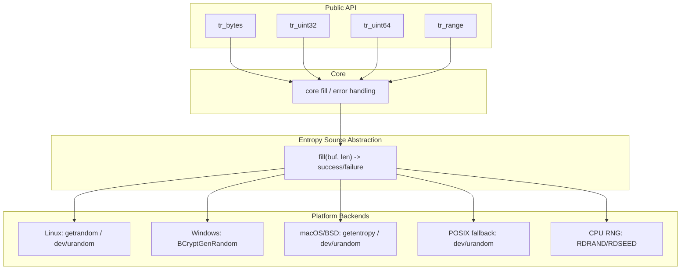
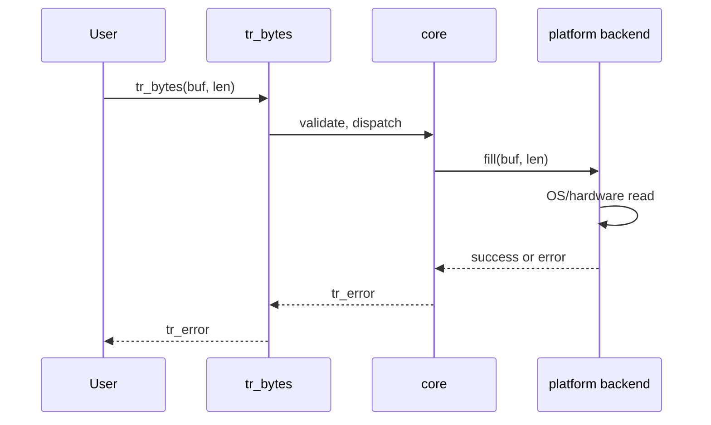

# libtruerandom — C Library Specification

**Version:** 1.0 (draft)  
**Language:** C17 (ISO/IEC 9899:2018)  
**Library name:** libtruerandom

---

## 1. Introduction and Scope

### 1.1 Purpose

libtruerandom is a small, portable C library that provides access to **true random** (entropy) bytes from operating-system and hardware sources. Many C programs need cryptographic-quality or otherwise unpredictable random data for nonces, tokens, session IDs, or seeding pseudorandom number generators. The C standard library offers only `rand()` and related functions, which are deterministic pseudorandom number generators and unsuitable for security-sensitive or uniqueness-critical uses. Platform-specific APIs for entropy exist—such as `/dev/urandom` on Unix, `getrandom()` on Linux, and `BCryptGenRandom()` on Windows—but they differ in name, semantics, and availability. libtruerandom exists to expose a **single, minimal, dependency-light** C API for reading entropy across supported platforms, so that application and library authors can obtain true random bytes without writing platform-specific code or depending on large third-party stacks.

### 1.2 Scope

The library **provides**:

- A core function to fill a caller-provided buffer with entropy bytes from the implementation’s chosen source(s).
- Optional convenience functions to obtain a single `uint32_t` or `uint64_t`, or a value in a specified integer range, derived from entropy.
- Consistent error reporting so that callers can distinguish unsupported platforms, I/O failures, and invalid arguments.
- Support for multiple platforms (Linux, Windows, macOS, and other POSIX-like systems) and, where available, use of CPU instructions (RDRAND/RDSEED) in addition to or in combination with OS entropy, as defined in the Architecture and Platform sections.

The library **does not** provide:

- Cryptographic primitives (e.g., encryption, hashing, digital signatures). It only supplies raw entropy bytes.
- A full CSPRNG (cryptographically secure pseudorandom number generator) implementation; it may supply entropy that callers use to seed their own PRNGs.
- Network-based or daemon-based entropy services; it relies on local OS and hardware sources only.
- Guarantees about FIPS compliance or certification; intended use is general-purpose entropy.

### 1.3 Goals

- **Portability:** Support Linux, Windows, and macOS/BSD with a single API; optional consideration for embedded or bare-metal environments in later versions.
- **Small API surface:** Few functions, with “fill buffer” as the core primitive and helpers as thin wrappers.
- **Clear failure semantics:** Every call that can fail returns an explicit error; no silent fallback to weak randomness.
- **No mandatory dependencies** beyond the C17 standard and the platform’s native APIs for entropy (and, where used, CPU RNG instructions). No dependency on OpenSSL or other crypto libraries for the core path.

### 1.4 Non-goals

- libtruerandom is not a replacement for the operating system’s entropy subsystem (e.g., `/dev/urandom` or the Windows RNG); it is a portable wrapper over it.
- It is not a general-purpose cryptography library.
- The library is not responsible for the quality or certification of the underlying OS or hardware entropy; it documents which sources are used so that deployers can assess their environment.

### 1.5 Target Users

Application and library authors who need a small, consistent C API for true (OS/hardware-sourced) randomness across platforms, without pulling in large dependencies or maintaining their own platform-specific entropy code.

---

## 2. Terminology and Definitions

The following terms are used consistently in this specification.

**Entropy** — In this document, *entropy* means unpredictable bits obtained from a designated source (e.g., the OS kernel or a hardware RNG). The library does not define or measure information-theoretic entropy; it treats “entropy” as the output of these designated sources.

**True random / hardware random** — Bytes that are derived from OS or hardware entropy sources (e.g., `getrandom()`, `/dev/urandom`, `BCryptGenRandom()`, or the RDRAND/RDSEED instructions) rather than from a deterministic algorithm. The library’s primary role is to supply such bytes to the caller.

**Pseudorandom number generator (PRNG)** — A deterministic algorithm that, given an initial state (seed), produces a sequence of numbers that appear random. The library is not primarily a PRNG; it may provide entropy that callers use to seed a PRNG.

**CSPRNG** — A cryptographically secure pseudorandom number generator. The library’s main role is supplying entropy, not implementing a full CSPRNG. Future versions may offer optional helpers (e.g., seeding a PRNG from entropy); the core API remains “fill buffer from entropy.”

**Entropy source** — A single mechanism that can provide bytes deemed to be entropy (e.g., the `getrandom()` syscall, reading `/dev/urandom`, calling `BCryptGenRandom()`, or executing RDRAND). The library may use one or more sources per platform, as defined in the Architecture and Platform sections.

**Backend** — An implementation component that fulfills the internal “fill buffer from entropy” contract for a specific platform or source (e.g., the Linux backend, the Windows backend, or the CPU RNG backend). Each backend is selected at compile time for the target platform; the public API does not expose backend choice.

---

## 3. Design Principles

**Minimal API** — The library shall expose few functions. The core primitive is filling a caller-provided buffer with entropy bytes. Convenience functions (e.g., for a single `uint32_t` or a value in a range) are thin wrappers that request the appropriate number of bytes and interpret them. No init/teardown or handle-based API is required for the primary use case.

**Explicit errors** — Every library call that can fail shall return an error (e.g., an enum or integer). There shall be no silent failure (e.g., returning success while leaving data uninitialized or falling back to a weak PRNG without the caller’s knowledge). Each function’s possible error returns shall be documented.

**No global state by default** — The design is stateless: no library-wide initialization or mutable global state is required for the documented API. If future versions add optional stateful features (e.g., a PRNG seeded from entropy), they shall use an explicit context or handle.

**Thread safety** — All public API functions shall be thread-safe: safe to call from multiple threads concurrently. The implementation shall not rely on unprotected global state for the core entropy path.

**Portability** — The implementation shall depend only on C17 and on platform-specific APIs for entropy (and, where used, CPU RNG instructions). There shall be no mandatory dependency on third-party libraries (e.g., OpenSSL) for the core path. Optional dependencies, if any, shall be clearly specified.

**Fail closed** — On an unsupported platform or when no entropy source is available, the library shall fail with a clear error (e.g., `TR_ERR_NOT_SUPPORTED` or `TR_ERR_NO_ENTROPY`) rather than silently falling back to weak or non-entropy randomness. Allowed fallbacks (e.g., trying a second source on the same platform) shall be explicitly defined in the Platform and Entropy Sources sections.

**Naming and style** — All public identifiers shall use the prefix `tr_`; constants and error codes shall use the prefix `TR_` (e.g., `TR_OK`, `TR_ERR_IO`). The library name is **libtruerandom**. Naming conventions are detailed in the Public API Specification (naming subsection).

---

## 4. Architecture and Module Layout

### 4.1 High-Level Architecture

libtruerandom is structured in layers: a **public API** layer, a **core** layer that validates arguments and dispatches to a backend, and **platform backends** (and optionally a **CPU RNG** backend) that implement the internal “fill buffer” contract. No platform-specific types or backend details leak into the public API.

### 4.2 Module Diagram



### 4.3 Source Selection

The library selects the entropy source at **compile time** based on the target platform (e.g., `#ifdef _WIN32`, `#elif defined(__linux__)`). Within a platform, the implementation may use a priority order: for example, on Linux, try `getrandom()` first and fall back to reading `/dev/urandom` if necessary. The exact order and fallbacks are specified in the Platform-Specific Behavior and Entropy Sources sections. There is no runtime switch to choose a different backend; the build target determines the backend(s) linked in.

### 4.4 CPU RNG (RDRAND/RDSEED) — In Scope for v1

RDRAND and RDSEED (and equivalent CPU instructions where available) are **in scope** for v1. The implementation may use them as an additional source of entropy (e.g., mixing with OS entropy) or as a fallback when OS entropy is unavailable, in a manner defined per platform. The library shall **not** use the CPU RNG as the **sole** source when a supported OS entropy source is available; that is, on supported platforms with OS entropy, at least one OS source shall be used (possibly in combination with CPU RNG). This ensures that the library does not rely exclusively on hardware that may vary in quality or availability. The Platform and Entropy Sources sections specify when and how RDRAND/RDSEED are used and on which platforms/CPUs they are supported.

### 4.5 Data Flow

When the user calls `tr_bytes(buf, len)` (or a convenience function that uses it internally), the core layer checks that `buf` is non-null and that `len` is valid (e.g., zero is allowed and results in success with no bytes written). The core then invokes the selected backend’s internal fill function (conceptually `fill(buf, len)` returning success or an error). The backend reads from the OS and/or hardware and writes exactly `len` bytes into `buf` on success, or returns an error without partially filling the buffer. The core maps backend errors to the public `tr_error` enum and returns to the caller. No partial success: either the full `len` bytes are written and success is returned, or an error is returned and the buffer contents are unspecified (see Error Handling).



### 4.6 Layering Rule

Platform-specific code shall only be invoked through the internal source abstraction (the fill contract). The public API shall not expose platform-specific types, file descriptors, or handles. All public types and constants are defined in the single public header.

---

## 5. File and Directory Layout

### 5.1 Repository Root

The project root shall contain at least:

- `README` (or `README.md`) — Purpose, build and install instructions, minimal example, and link to this specification.
- `LICENSE` — License terms.
- This specification — `docs/SPECIFICATION.md` (or `SPEC.md` in the root, as chosen by the project).
- `include/` — Public header(s).
- `src/` — Source files and internal headers.
- `tests/` — Test sources.
- Build configuration — e.g., `CMakeLists.txt` and/or `Makefile`.
- Optionally `docs/` for additional documentation and `cmake/` for CMake modules.

### 5.2 Include Layout

There shall be a **single public header** for the library. Its path under the repository and under the install prefix shall be:

- `include/truerandom/truerandom.h`

Consumers include it as `#include <truerandom/truerandom.h>`. No other public headers are required for v1. If the project adds a separate header for optional RDRAND/RDSEED configuration, that shall be explicitly specified in a future revision.

### 5.3 Source Layout

- **Core:** `src/core.c` — Implements the public API, validates parameters, and calls the selected backend’s fill function. Contains no platform-specific logic beyond dispatch (e.g., compile-time selection of which backend to call).
- **Platform backends:** One file per supported platform (or family), e.g.:
  - `src/linux.c` — Linux: `getrandom()` and/or `/dev/urandom`.
  - `src/windows.c` — Windows: `BCryptGenRandom()` (or documented alternative).
  - `src/darwin.c` — macOS: `getentropy()` and/or `/dev/urandom`.
  - `src/posix_fallback.c` — Generic POSIX: open and read `/dev/urandom` (for BSD and other Unix-like systems).
- **CPU RNG (optional):** `src/cpu_rng.c` (or equivalent) — Implements the internal fill contract using RDRAND/RDSEED where available. Used by the core or platform backends as specified (mixing or fallback), not as a standalone public backend.
- **Internal headers:** All non-public declarations (e.g., the backend fill contract) shall live in headers under `src/` (e.g., `src/sources.h` or `src/backend.h`). These shall not be installed.

Naming: all source files use the `.c` extension; internal headers use `.h`. No `.inl` or other extension is required unless the project explicitly adds one.

### 5.4 Install Layout

When installed (e.g., via `make install` or CMake install):

- **Prefix:** Configurable (e.g., `/usr/local` or a custom prefix).
- **Headers:** Installed under `$(prefix)/include/truerandom/truerandom.h` so that `#include <truerandom/truerandom.h>` works with `-I$(prefix)/include`.
- **Library:** The static library shall be named `libtruerandom.a` (Unix). The shared library shall be named `libtruerandom.so` (Unix) or the platform equivalent (e.g., `truerandom.dll` on Windows with the appropriate import library). The link name for the library (e.g., `-ltruerandom`) shall be **truerandom**.
- **pkg-config:** If provided, the package name shall be `libtruerandom` and the file `libtruerandom.pc` shall be installed in the appropriate pkg-config directory.

### 5.5 Build Artifacts

Object files and built libraries shall be placed in a build directory (e.g., `build/` or `out/`) and shall not be committed to version control. The specification does not mandate a specific build directory name; the build system documentation shall define it.

### 5.6 Canonical Directory Tree

```
project_root/
├── README or README.md
├── LICENSE
├── CMakeLists.txt   (and/or Makefile)
├── docs/
│   └── SPECIFICATION.md
├── include/
│   └── truerandom/
│       └── truerandom.h
├── src/
│   ├── core.c
│   ├── linux.c
│   ├── windows.c
│   ├── darwin.c
│   ├── posix_fallback.c
│   ├── cpu_rng.c       (optional, for RDRAND/RDSEED)
│   └── sources.h       (or backend.h — internal)
├── tests/
│   └── ...
└── build/              (or similar; not committed)
```

---

## 6. Public API Specification

### 6.1 Header

The public header `truerandom/truerandom.h` shall:

- Use an include guard (e.g., `#ifndef TRUERANDOM_TRUERANDOM_H` / `#define` / `#endif`).
- Include `<stddef.h>` and `<stdint.h>` (or equivalent) for `size_t` and fixed-width types.
- Wrap the declarations in `#ifdef __cplusplus` `extern "C"` `#endif` so the library can be used from C++.

### 6.2 Types

The library shall use the standard type `size_t` for buffer lengths. No public opaque handle or context type is required for the core API (stateless use). The only public type introduced by the library is the error enumeration `tr_error`.

### 6.3 Error Handling

All functions that can fail shall return a value of type `tr_error`. The enumeration shall include at least:

- `TR_OK` — Success.
- `TR_ERR_NOT_SUPPORTED` — The platform or entropy source is not supported (e.g., unsupported OS or build target).
- `TR_ERR_IO` — An I/O or system error occurred while obtaining entropy (e.g., `getrandom` or read from `/dev/urandom` failed).
- `TR_ERR_PARAM` — Invalid parameter (e.g., null buffer when non-null is required, or invalid range for `tr_range`).
- `TR_ERR_NO_ENTROPY` — No entropy available (e.g., source temporarily unavailable); optional, if the implementation can distinguish this from a generic I/O error.

The implementation may map platform errors (e.g., `errno`) to these codes in a documented way. Each function’s specification shall list the errors it can return. On success, the function shall return `TR_OK`. On failure, no success value shall be returned; the buffer (if any) shall be left in an unspecified state (see Error Handling and Failure Modes).

### 6.4 Core Function

**Function:** `tr_error tr_bytes(void *buf, size_t len)`

**Semantics:** Fill the buffer pointed to by `buf` with exactly `len` bytes of entropy from the implementation’s default source(s). The buffer shall be valid for at least `len` bytes; the behavior is undefined if `buf` is null when `len > 0`, or if the buffer is otherwise invalid.

**Parameters:**

- `buf` — Pointer to the buffer to fill. May be null only if `len` is 0.
- `len` — Number of bytes to write. May be zero; in that case the function shall return `TR_OK` without writing.

**Returns:** `TR_OK` on success; on success, exactly `len` bytes have been written to `buf`. On failure, returns one of `TR_ERR_PARAM`, `TR_ERR_NOT_SUPPORTED`, `TR_ERR_IO`, or `TR_ERR_NO_ENTROPY` (see Error Handling). On failure, the contents of `buf` are unspecified; the implementation need not have written any bytes.

**Blocking:** The function may block briefly (e.g., on first read from the OS) on some platforms. The specification does not guarantee non-blocking behavior.

**Thread safety:** Thread-safe.

### 6.5 Convenience Functions

**tr_uint32:** `tr_error tr_uint32(uint32_t *out)`  
Fills the 4 bytes of `*out` with entropy (e.g., by calling the internal fill with a 4-byte buffer). Returns `TR_OK` on success. Requires `out != NULL`; otherwise returns `TR_ERR_PARAM`. Thread-safe.

**tr_uint64:** `tr_error tr_uint64(uint64_t *out)`  
Same as `tr_uint32` but for 8 bytes. Thread-safe.

**tr_range:** `tr_error tr_range(uint32_t *out, uint32_t min_inclusive, uint32_t max_inclusive)`  
Writes into `*out` a value in the closed interval [min_inclusive, max_inclusive] derived from entropy. **Unbiased distribution is guaranteed only when (max_inclusive - min_inclusive + 1) is a power of two.** For other ranges, the implementation may use rejection sampling or another method; the distribution may be biased, and the spec shall document the behavior (e.g., “rejection sampling; slight bias possible for non-power-of-two range sizes”). The function shall return `TR_ERR_PARAM` if `out` is null or if `min_inclusive > max_inclusive`. Thread-safe.

### 6.6 Optional and Future API

`tr_seed_prng` (or similar) is **not** part of v1. Future versions may add optional helpers; the v1 API is limited to `tr_bytes`, `tr_uint32`, `tr_uint64`, and `tr_range` as specified.

### 6.7 Thread Safety and Lifecycle

All functions listed above shall be thread-safe. No initialization or teardown function is required; there are no handles to close. The library may use internal one-time initialization (e.g., for opening `/dev/urandom`) in a thread-safe way.

### 6.8 Naming Convention

- **Prefix:** All public functions and types use the prefix `tr_` (e.g., `tr_bytes`, `tr_error`).
- **Constants and enums:** Use the prefix `TR_` (e.g., `TR_OK`, `TR_ERR_IO`).
- **Pattern:** Functions are named `tr_<verb>_<noun>` or `tr_<noun>` as appropriate (e.g., `tr_bytes`, `tr_uint32`, `tr_range`).

---

## 7. Platform-Specific Behavior

### 7.1 Linux

The implementation shall prefer the `getrandom()` syscall (or its libc wrapper) with flags that request non-blocking behavior when possible (e.g., `getrandom(buf, len, 0)`). If `getrandom()` is unavailable at compile or runtime (e.g., older kernel or libc), the implementation shall fall back to opening and reading from `/dev/urandom`. The library shall **not** use `/dev/random` by default for the primary API, because `/dev/random` may block indefinitely when the kernel’s entropy pool is depleted; `/dev/urandom` is sufficient for cryptographic use and is non-blocking (or blocks only briefly). The specification shall document the minimum kernel and glibc versions for `getrandom()` when the implementation relies on it (e.g., Linux 3.17+, glibc 2.25+ for the wrapper).

### 7.2 Windows

The implementation shall use `BCryptGenRandom()` (from the bcrypt API) as the primary source. The minimum supported Windows version (e.g., Vista or later) shall be documented. The implementation shall not fall back to a user-space PRNG; if the OS API fails, the library shall return an error (e.g., `TR_ERR_IO` or `TR_ERR_NO_ENTROPY`).

### 7.3 macOS and BSD

On macOS and BSD systems that provide `getentropy()`, the implementation shall use it. Otherwise, it shall open and read from `/dev/urandom`. The library shall **not** use `arc4random()` for the primary entropy API, because `arc4random()` is a PRNG (even if seeded from the OS); the library’s contract is to provide bytes from a designated entropy source, not from a PRNG. Use of `arc4random()` could be considered in a future optional “fast random” API; for v1, only OS/hardware entropy sources are used.

### 7.4 Other POSIX

On other POSIX-like systems (e.g., FreeBSD, OpenBSD), the implementation shall use the same strategy as for macOS/BSD: `getentropy()` if available, otherwise `/dev/urandom`. The list of tested or expected systems shall be documented (e.g., in the README or Platform matrix in the Appendix).

### 7.5 Embedded / Bare Metal

Embedded or bare-metal targets are **out of scope** for v1. The build may provide a stub that returns `TR_ERR_NOT_SUPPORTED` for all functions, along with a porting guide describing how a vendor could supply a custom fill implementation (e.g., a weak symbol or compile-time hook) for their platform.

### 7.6 Compile-Time Selection

The backend shall be selected at compile time using preprocessor macros. The implementation shall use a consistent set (e.g., `_WIN32` for Windows, `__linux__` for Linux, `__APPLE__` for macOS, and a fallback for other POSIX). The exact macros and order shall be documented in the source and in the Platform matrix (Appendix C).

### 7.7 Runtime Behavior

The library may block on the first read (e.g., when opening `/dev/urandom` or when the kernel is gathering entropy). The specification does not guarantee constant-time execution; timing side channels are outside the scope of v1.

---

## 8. Entropy Sources and Backends

### 8.1 List of Backends

| Backend name   | Platform        | API / source              | Priority (1 = first) |
|----------------|------------------|---------------------------|------------------------|
| Linux          | Linux            | getrandom, /dev/urandom   | 1                      |
| Windows        | Windows          | BCryptGenRandom           | 1                      |
| Darwin         | macOS            | getentropy, /dev/urandom  | 1                      |
| POSIX fallback | BSD, other Unix  | /dev/urandom              | 1                      |
| CPU RNG        | x86/x64 (Intel/AMD) | RDRAND, RDSEED         | 2 (supplement/fallback)|

Priority 2 means the CPU RNG is used in addition to or as fallback to the OS source, not as the sole source when OS entropy is available.

### 8.2 Backend Contract

Each backend implements an internal function with the following contract: given a buffer pointer and a length, it shall write exactly that many bytes of entropy to the buffer and return a success indicator, or return an error without partially filling. The backend shall not allocate memory for the buffer; the caller provides it. All errors shall be mappable to the public `tr_error` set (e.g., I/O failure → `TR_ERR_IO`, unsupported → `TR_ERR_NOT_SUPPORTED`).

### 8.3 Priority and Selection

The build selects one primary backend per platform (Linux, Windows, Darwin, or POSIX fallback). Optionally, the CPU RNG backend is compiled in and used for mixing or fallback as specified. There is no runtime switching of backend; the selection is fixed at build time.

### 8.4 RDRAND/RDSEED (In Scope for v1)

When the CPU RNG backend is used, the implementation shall use RDRAND and/or RDSEED where available (e.g., on x86/x64 with Intel or AMD CPUs that support these instructions). The implementation may use CPU RNG output to mix with OS entropy (e.g., XOR or a simple mix) or as a fallback when the OS source fails. The implementation shall **not** use the CPU RNG as the sole source on platforms where an OS entropy source is supported and available. The documentation shall list the platforms and CPU families for which RDRAND/RDSEED are used (e.g., x86_64 Linux/Windows/macOS when the instructions are detected or assumed).

---

## 9. Build and Integration

### 9.1 Build System

The primary build system shall be CMake (or Make, as a project choice). The minimum CMake version (e.g., 3.10 or 3.14) shall be documented. Options shall include at least:

- `BUILD_SHARED_LIBS` — Build shared library when ON, static when OFF (or the project’s chosen convention).
- `TRUERANDOM_INSTALL` (or similar) — Whether to install headers and libraries.
- `TRUERANDOM_TESTS` — Whether to build and run tests.

### 9.2 Config and Feature Detection

Platform detection shall be done at compile time via the standard macros (`_WIN32`, `__linux__`, `__APPLE__`, etc.). Optional detection (e.g., for `getrandom()` availability) may be done via a configure step or CMake check; the chosen method shall be documented.

### 9.3 Install

The install target shall install the public header(s) to the include path, the static and/or shared library to the library path, and optionally the pkg-config file. Paths shall follow the Install Layout (Section 5.4).

### 9.4 Usage by Consumers

A consumer shall include the header with `#include <truerandom/truerandom.h>` and link with `-ltruerandom` (or the platform equivalent). No compile-time defines shall be required for default use. The consumer shall use a C17-compatible compiler.

### 9.5 C Standard

The library shall be written and built with **C17** (ISO/IEC 9899:2018). The build shall set the compiler to C17 (e.g., `-std=c17` or `-std=c11` where C17 is not yet available, with a note that C17 is the target). Any use of C17-specific features (e.g., `_Thread_local` for thread-local state, if used) shall be documented. Minimum compiler versions (e.g., GCC 7+, Clang 5+, MSVC 2017+) shall be documented as needed.

---

## 10. Error Handling and Failure Modes

### 10.1 Guarantees

On success, the library shall return `TR_OK` and shall have written exactly the requested bytes from the documented entropy source(s). The library shall never return success when the buffer has been left uninitialized or filled with non-entropy data (e.g., from a weak PRNG used as an undocumented fallback).

### 10.2 Failure Modes

- **Unsupported platform:** `TR_ERR_NOT_SUPPORTED` — The build target or runtime platform has no supported backend.
- **I/O or system error:** `TR_ERR_IO` — Reading from the OS or hardware failed (e.g., `getrandom` failed, or read from `/dev/urandom` failed).
- **Invalid parameter:** `TR_ERR_PARAM` — Null pointer where required, or invalid range (e.g., `min_inclusive > max_inclusive` in `tr_range`).
- **No entropy available:** `TR_ERR_NO_ENTROPY` — Optional; used when the implementation can distinguish “no entropy” from a generic I/O error.

### 10.3 No Partial Success

The library shall not return success after writing only part of the requested bytes. Either the full `len` bytes are written and `TR_OK` is returned, or an error is returned and the buffer contents are unspecified (the caller shall not rely on any partial write).

### 10.4 Documentation of Errors

Each public function’s specification shall list the errors it can return. The implementation may return additional error codes only for the same logical conditions (e.g., different `errno` values mapped to the same `tr_error`).

---

## 11. Security Considerations

### 11.1 Intended Use

libtruerandom is intended for general-purpose entropy: seeding PRNGs, generating nonces, tokens, session IDs, and similar values that require unpredictability. It does not provide a guarantee of FIPS compliance or any certification; deployers in regulated environments are responsible for assessing the underlying OS and hardware.

### 11.2 What the Library Does Not Do

The library does not clear buffers on error; if a caller has placed sensitive data in a buffer and an error occurs, the caller is responsible for clearing it. The library does not guarantee constant-time execution. It does not perform cryptographic operations beyond reading entropy; it does not hash, encrypt, or sign.

### 11.3 Clear Buffers

The specification recommends that callers clear sensitive buffers if an error occurs (e.g., zero the buffer before discarding). The library is not required to wipe buffers on failure.

### 11.4 Dependencies and Attack Surface

The core path has no dependency on third-party crypto libraries, reducing the attack surface. The implementation shall be kept small and the list of backends explicit to facilitate audit and review.

---

## 12. Testing and Quality

### 12.1 Unit Tests

Unit tests shall cover parameter validation: null buffer (when `len > 0`), zero length, and invalid range in `tr_range`. Error paths shall be tested (e.g., by mocking the backend to return failure). Unit tests shall not assert on “entropy quality” (e.g., distribution tests); that is left to integration or optional quality tests.

### 12.2 Integration Tests

On each supported platform, integration tests shall call `tr_bytes` (and optionally the convenience functions), assert success, and perform a minimal sanity check (e.g., that the buffer is not filled with a single constant byte). Optional entropy quality tests (e.g., byte distribution, or delegation to an external tool) may be included but are not mandatory for the specification.

### 12.3 CI

Continuous integration shall build the library on Linux, Windows, and macOS (or a subset as resources allow) and run the test suite. The specification does not require mandatory entropy quality gates (e.g., FIPS tests); projects may add them as optional.

### 12.4 Static Analysis

The specification recommends running static analysis (e.g., Clang static analyzer, Coverity) where practical; it is not a mandatory requirement of the spec.

---

## 13. Documentation and Examples

### 13.1 README

The project README shall describe the purpose of libtruerandom, how to build and install it, and a minimal example (e.g., “fill 32 bytes and print hex”). It shall link to this full specification.

### 13.2 In-Spec Examples

**Minimal use:** Fill a 16-byte buffer and check for success:

```c
#include <truerandom/truerandom.h>
#include <stdio.h>

int main(void) {
    unsigned char buf[16];
    tr_error err = tr_bytes(buf, sizeof buf);
    if (err != TR_OK) {
        fprintf(stderr, "tr_bytes failed: %d\n", (int)err);
        return 1;
    }
    for (size_t i = 0; i < sizeof buf; i++)
        printf("%02x", buf[i]);
    printf("\n");
    return 0;
}
```

**Error handling:** Check return value and handle errors:

```c
tr_error err = tr_bytes(buf, len);
switch (err) {
    case TR_OK:           break; /* use buf */
    case TR_ERR_PARAM:     /* invalid arguments */ break;
    case TR_ERR_NOT_SUPPORTED: /* platform unsupported */ break;
    case TR_ERR_IO:        /* I/O error */ break;
    case TR_ERR_NO_ENTROPY:    /* no entropy */ break;
    default:               /* handle unknown */ break;
}
```

### 13.3 Man Pages / API Docs

Man pages or generated API documentation are optional. If provided, each public function shall have a section that can be derived from or aligned with this specification.

---

## 14. Versioning and Compatibility

### 14.1 Version Scheme

The project shall use semantic versioning (MAJOR.MINOR.PATCH). Shared library builds shall preserve ABI compatibility within a MAJOR version when possible.

### 14.2 API Stability

Within the 1.x series, the public API shall remain stable: new functions may be added in MINOR versions, but existing functions shall not be removed or changed in a breaking way. Breaking changes require a new MAJOR version.

### 14.3 Deprecation

Deprecation of a function or symbol shall be announced in the header (e.g., a comment or attribute) and in release notes. A deprecated symbol shall remain available for at least one MINOR version before removal in a MAJOR version.

---

## 15. References and Appendix

### 15.1 References

- Linux `getrandom(2)` — man page and kernel documentation.
- Windows `BCryptGenRandom` — Microsoft documentation.
- C17 — ISO/IEC 9899:2018 (C17).
- `/dev/urandom` — Linux and BSD random(4) documentation.
- Intel 64 and IA-32 Architectures Software Developer’s Manual (RDRAND, RDSEED).
- AMD64 Architecture Programmer’s Manual (RDRAND/RDSEED equivalent).

### Appendix A — Full Directory Tree

```
project_root/
├── README or README.md
├── LICENSE
├── CMakeLists.txt   (and/or Makefile)
├── docs/
│   └── SPECIFICATION.md
├── include/
│   └── truerandom/
│       └── truerandom.h
├── src/
│   ├── core.c
│   ├── linux.c
│   ├── windows.c
│   ├── darwin.c
│   ├── posix_fallback.c
│   ├── cpu_rng.c       (optional)
│   └── sources.h       (internal)
├── tests/
│   └── ...
└── build/
```

### Appendix B — Error Code Quick Reference

| Symbol                 | Meaning                                  |
|------------------------|------------------------------------------|
| `TR_OK`                | Success                                  |
| `TR_ERR_NOT_SUPPORTED` | Platform or source not supported         |
| `TR_ERR_IO`            | I/O or system error                      |
| `TR_ERR_PARAM`         | Invalid parameter                         |
| `TR_ERR_NO_ENTROPY`    | No entropy available (optional)          |

### Appendix C — Platform Matrix

| Platform   | Backend          | APIs / sources used           | Notes                          |
|------------|-------------------|-------------------------------|--------------------------------|
| Linux      | Linux             | getrandom, /dev/urandom       | getrandom preferred            |
| Windows    | Windows           | BCryptGenRandom               | bcrypt.dll                     |
| macOS      | Darwin            | getentropy, /dev/urandom      | getentropy on recent macOS     |
| FreeBSD etc| POSIX fallback    | /dev/urandom                  | getentropy if available        |
| x86/x64    | CPU RNG (optional)| RDRAND, RDSEED                | Supplement/fallback only       |

---

*End of specification.*
